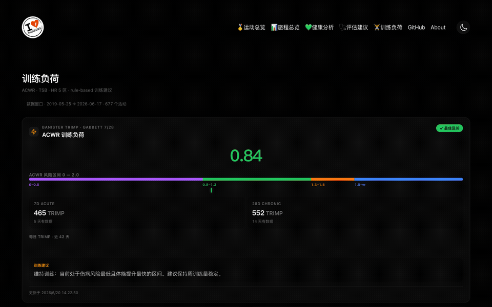

<p align="center">
  
</p>

<p align="center">
  <strong>Sports Fair — 运动集市</strong><br>
  个人运动数据仪表盘 · 整合 Apple Health / Strava / Garmin / Keep · 训练分析 · AI 评估
</p>

<p align="center">
  <a href="README.md">English</a> · <a href="README.zh-CN.md">简体中文</a>
</p>

<p align="center">
  <a href="https://github.com/wuleiyuan/sports-fair/blob/master/LICENSE"></a>
  <a href="https://github.com/wuleiyuan/sports-fair/releases"></a>
  <a href="https://github.com/wuleiyuan/sports-fair/pulls"></a>
  <a href="https://github.com/yihong0618/running_page"></a>
</p>

---

## What is Sports Fair?

Sports Fair is an open-source fitness dashboard. It takes your raw workout data from Apple Watch, Garmin, Strava, and more — and turns it into clear charts, science-based training metrics, and personalized AI health insights.

<p align="center">
  
  <br>
  <em>Page overview: activity map, training load, health assessment, yearly stats</em>
</p>

It answers real questions about your training:

| Your Question | How Sports Fair Answers It |
|---------------|---------------------------|
| Am I training too hard? | **ACWR (Acute:Chronic Workload Ratio)** — above 1.5 means increased injury risk |
| Am I fresh or fatigued? | **TSB (Training Stress Balance)** — negative = fatigued, positive = recovered |
| Is my health improving? | **5-Dimension Health Assessment** — RHR / HRV / Sleep / Steps / Training Load |
| What should I work on next? | **AI Coach** — LLM-powered personalized advice |
| How far did I run this year? | **Yearly Stats** — distance, duration, elevation, count |

---

## Screenshots

| 🏠 Home — Activity Map & Timeline | 📈 Training — ACWR / TSB / HR Zones |
|:---:|:---:|
|  |  |

---

## Features

### 🗺️ Interactive Activity Map
Browse all your activities on **MapLibre** — a fully open-source map engine that needs **no API token**. Switch between street, satellite, and terrain views to explore every route.

### 📊 5-Dimension Health Assessment
AI evaluates five key health metrics and gives each a score + personalized recommendation:

| Dimension | What It Measures |
|-----------|-----------------|
| Resting Heart Rate | Cardiovascular fitness baseline |
| Heart Rate Variability | Autonomic nervous system recovery |
| Sleep | Duration & regularity |
| Daily Steps | Overall activity level |
| Training Load | Exercise intensity & recovery status |

Powered by LLM (supports MiMo / OpenAI / Anthropic).

### 📈 Training Load Analysis
Three scientifically validated metrics to quantify training stress:

| Metric | Full Name | What It Tells You |
|--------|-----------|-------------------|
| **ACWR** | Acute:Chronic Workload Ratio (Gabbett) | Is your training ramping too fast? (sweet spot: 0.8–1.3) |
| **TSB** | Training Stress Balance (Coggan) | Are you fresh or fatigued? (>+15 = recovered, <-15 = overtrained) |
| **HR Zones** | 5-Zone Heart Rate (Karvonen) | Intensity distribution of each workout (Z1 recovery → Z5 anaerobic) |

### 🧠 AI Coach
LLM analyzes your recent data and generates actionable advice — adjust training load, improve recovery, vary workout types. Supports MiMo, OpenAI, and Anthropic.

### 🎯 Multi-Sport
Running, cycling, swimming, rope skipping, stair climbing, and more. Each sport shows relevant metrics (distance, count, or duration).

### 🎨 Orange-Black Theme
Dark UI with orange accents, frosted glass cards, and bento grid layout. Consistent across all pages.

### 📱 PWA
Install as a standalone app on your phone home screen. Works offline for cached content.

---

## How It Works

```
Your Devices (Apple Watch / Garmin / Strava / etc.)
        │
        ▼
  ┌─────────────────────┐
  │  GitHub Actions      │  ← Automated daily sync
  │  Python sync scripts │
  └──────────┬──────────┘
             │
             ▼
  ┌─────────────────────┐
  │  SQLite Database     │  ← Stored in the repo
  │  (activities,        │
  │   health metrics)    │
  └──────────┬──────────┘
             │
             ▼
  ┌─────────────────────┐
  │  React Frontend      │  ← Deployed on Vercel
  │  (MapLibre maps,     │
  │   Tailwind dark UI)  │
  └──────────┬──────────┘
             │
             ▼
  ┌─────────────────────┐
  │  Your Browser        │  ← PWA, installable
  └─────────────────────┘
```

Fully automated: GitHub Actions fetches data → updates the database → triggers a fresh Vercel deploy. No server to manage.

---

## Pages

| Page | Path | Description |
|------|------|-------------|
| 🏠 Home | `/` | Activity map & timeline — browse all routes on MapLibre |
| 📊 Stats | `/stats` | Yearly breakdown — distance, duration, elevation, count |
| ❤️ Health | `/health` | Apple HealthKit metrics — RHR, HRV, Sleep, Steps |
| 🩺 Health Assess | `/health-assess` | AI 5-dimension health score & personalized advice |
| 🏋️ Training | `/training` | ACWR / TSB / HR zone analysis with trend charts |
| 📋 Activities | `/activities` | Full activity list with filters & search |
| ⏱️ Recents | `/recents` | Recent activities at a glance |

---

## Tech Stack

| Layer | Technology |
|-------|-----------|
| **Frontend** | TypeScript, React, Vite, Tailwind CSS |
| **Maps** | MapLibre GL (open-source, no API key) |
| **Data Sync** | Python |
| **Database** | SQLite |
| **CI/CD** | GitHub Actions |
| **Hosting** | Vercel |
| **PWA** | vite-plugin-pwa |
| **AI** | MiMo / OpenAI / Anthropic APIs (optional) |

---

## Getting Started

### Option 1: Deploy to Vercel (Recommended)

[](https://vercel.com/new/clone?repository-url=https%3A%2F%2Fgithub.com%2Fwuleiyuan%2Fsports-fair)

Click the button above, authorize GitHub, and Vercel will automatically fork and deploy the project. **Zero config, online in a minute.**

### Option 2: Local Development

```bash
git clone https://github.com/wuleiyuan/sports-fair.git
cd sports-fair
pip3 install -r requirements.txt
npm install -g corepack && corepack enable
pnpm install
pnpm develop
```

Open [http://localhost:5173](http://localhost:5173).

### Data Sync

After deployment, data syncs automatically via **GitHub Actions**. Supported sources:

> **Garmin** · **Garmin-CN** · **Strava** · **Nike Run Club** · **Keep** · **GPX** · **TCX** · **FIT**

See [Data Sync Guide](docs/DATA_SYNC.md) for per-source setup instructions.

---

## Upstream

Built on [yihong0618/running_page](https://github.com/yihong0618/running_page) (10k+ stars). We forked, redesigned the UI, and expanded the feature scope.

**Inherited components:**
- Python data sync adapters (Garmin / Strava / Nike / Keep)
- GitHub Actions automation
- Core data models & SQLite schema
- Map & timeline rendering
- GPX / TCX / FIT import pipeline

Thanks to [@yihong0618](https://github.com/yihong0618) and all [running_page contributors](https://github.com/yihong0618/running_page/graphs/contributors).

---

## License

[MIT](LICENSE)
