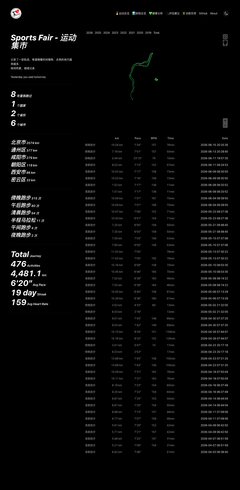
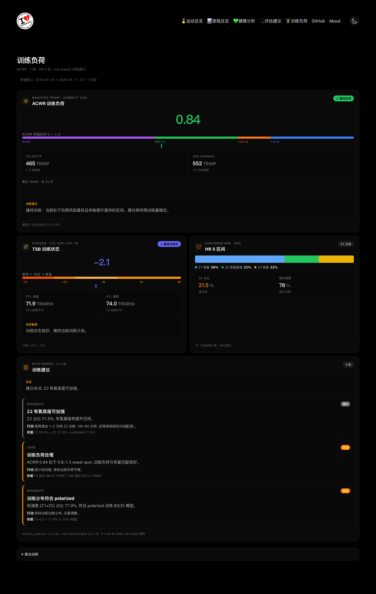

  

  <strong>Sports Fair — 运动集市</strong> 
  多数据源运动可视化仪表盘 · Apple Health / Strava / Garmin / Keep / GPX

  <a href="README.md">English</a> · <a href="README.zh-CN.md">简体中文</a>

  
  
  
  
  

---

### 🚀 一键部署到 Vercel

---

## 功能

| | |
|---|---|
| 🏃 **多数据源** | Apple HealthKit / Strava / Garmin / Keep / Nike / GPX / TCX / FIT |
| 🗺️ **开源地图** | 使用 MapLibre，**无需任何 API Token** |
| 📊 **健康评估** | 五维评估 — 静息心率 / HRV / 睡眠 / 步数 / 训练负荷 |
| 📈 **训练分析** | ACWR (Gabbett) + TSB (Coggan) + 心率五区间 (Karvonen) |
| 🧠 **AI 教练** | 大模型个性化建议（支持 MiMo / OpenAI / Anthropic） |
| 🎨 **橙黑主题** | 深色背景 + 橙色强调色，毛玻璃卡片布局 |
| 📱 **PWA 支持** | 可安装为手机应用 |
| 🎯 **运动类型** | 跑步、骑行、游泳、跳绳、爬楼等 |

## 页面

| 页面 | 说明 |
|------|------|
| `/` | 活动地图 & 时间线 — MapLibre 地图浏览所有活动 |
| `/stats` | 逐年统计 — 距离、时长、爬升、次数 |
| `/health` | Apple HealthKit 健康指标 |
| `/health-assess` | AI 五维健康评估 |
| `/training` | ACWR / TSB / 心率区间分析 |
| `/activities` | 全部活动列表（可筛选） |
| `/recents` | 近期活动摘要 |

  

## 快速开始

1. **[Fork](https://github.com/wuleiyuan/sports-fair/fork) 本仓库**
2. **导入 Vercel**（点击上方按钮）— 零配置
3. **同步数据** — GitHub Actions 自动拉取，或上传 GPX/TCX/FIT 文件

> 完整文档：[CHANGELOG](CHANGELOG.md) · [CONTRIBUTING](CONTRIBUTING.md) · [版本流程](docs/VERSION_PROCESS.md)

## 技术栈

`TypeScript` · `React` · `Vite` · `Tailwind CSS` · `MapLibre GL` · `PWA` · `Python` · `GitHub Actions` · `Vercel`

## 上游项目

本项目基于 [yihong0618/running_page](https://github.com/yihong0618/running_page) 构建 —— 一个 10k+ stars 的优秀开源跑步数据仪表盘。我们 fork 后重新设计了 UI 并大幅扩展了功能范围。

**从上游继承的部分：**
- Python 数据同步基础设施（Garmin / Strava / Nike / Keep 适配器）
- GitHub Actions 自动化数据拉取
- 核心数据模型与数据库 schema
- 原始地图和时间线渲染逻辑
- GPX / TCX / FIT 导入管道

衷心感谢 [@yihong0618](https://github.com/yihong0618) 及所有 [running_page 贡献者](https://github.com/yihong0618/running_page/graphs/contributors)。如果你觉得这个项目有用，也请给 [上游项目](https://github.com/yihong0618/running_page) 点个 star。

## 许可证

[MIT](LICENSE)
